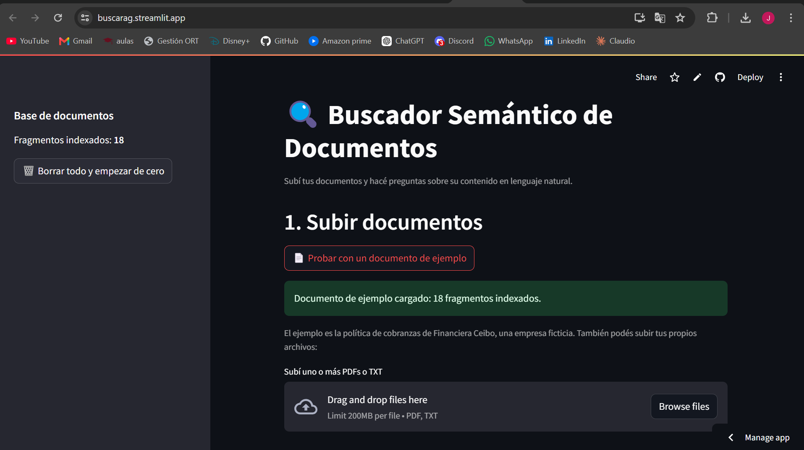
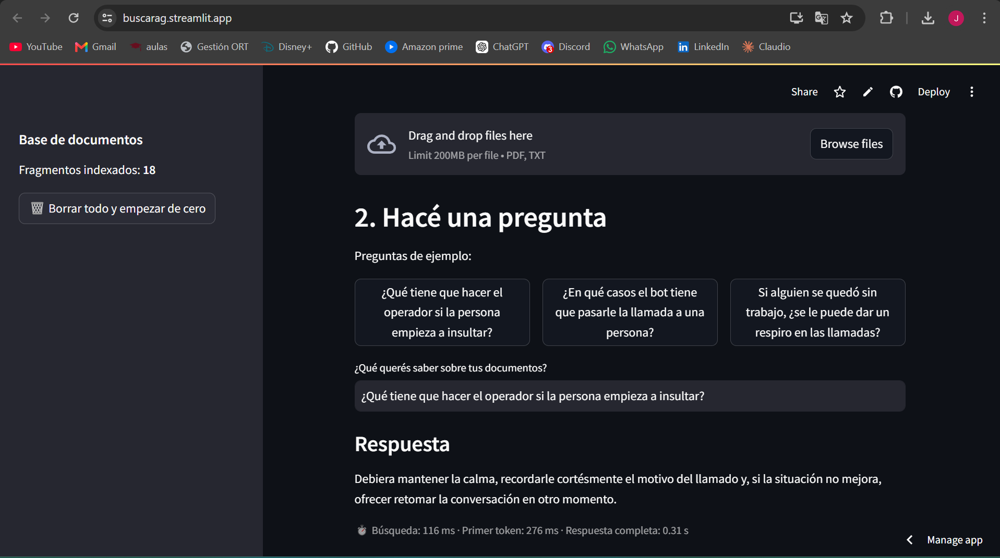
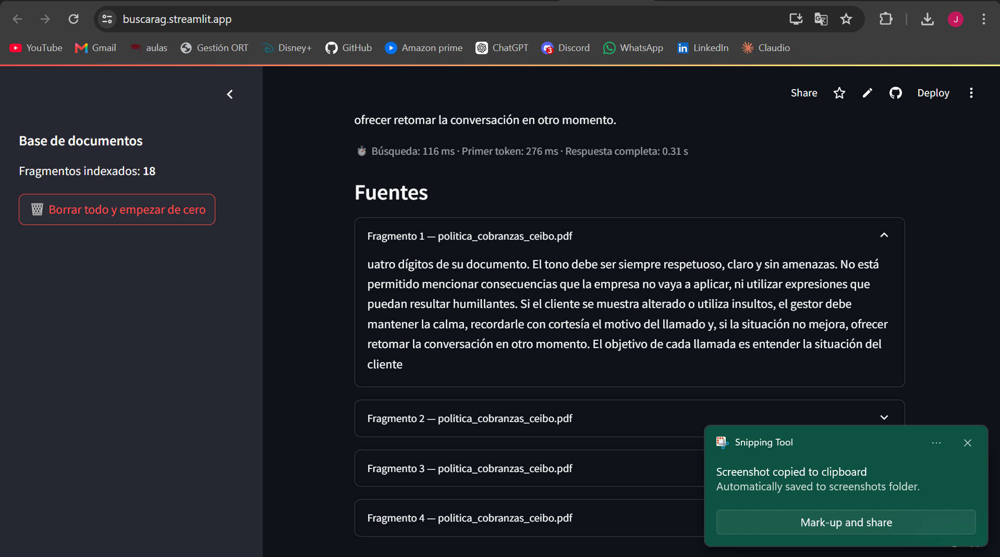

# Buscarag: Buscador Semántico de Documentos (RAG)

Sistema de **Retrieval-Augmented Generation (RAG)** que permite subir documentos (PDF/TXT) y hacer preguntas sobre su contenido en lenguaje natural. A diferencia de un buscador tradicional, que busca coincidencias exactas de palabras, este sistema entiende el **significado** de la consulta gracias a embeddings semánticos, y genera una respuesta a partir de los fragmentos más relevantes de los documentos, mostrando las fuentes que la sustentan.

### 👉 [Probar la demo online](https://buscarag.streamlit.app)

La demo incluye un documento de ejemplo (la política de cobranzas de una financiera ficticia) que se carga con un clic, junto con preguntas sugeridas para probarla sin necesidad de subir archivos propios.

**Lo más destacado del proyecto:**

- **Evaluación automática** con un set de preguntas de prueba: gracias a ella se detectó que el modelo de embeddings original rendía mal en español, y los cambios aplicados llevaron la precisión de recuperación del **68% al 89%**, sin respuestas inventadas.
- **Respuestas en streaming y medición de latencia** por etapa: búsqueda, tiempo hasta el primer token y respuesta completa.
- **13 tests automatizados** con pytest, que corren sin internet en menos de un segundo y que detectaron un bug real en la ingesta.

## Demo

El documento de ejemplo se carga con un solo clic, sin necesidad de subir archivos propios:



La respuesta se muestra en streaming, con el tiempo de cada etapa:



Y debajo quedan los fragmentos exactos del documento en los que se basó:



## Cómo funciona

1. **Ingesta**: el documento se extrae y se divide en fragmentos (*chunks*) de 500 caracteres, con 50 caracteres de superposición entre ellos para no cortar ideas a la mitad.
2. **Embeddings**: cada fragmento se convierte en un vector numérico que representa su significado, usando `sentence-transformers` con el modelo multilingüe `paraphrase-multilingual-MiniLM-L12-v2`, que corre 100% local y sin costo.
3. **Almacenamiento vectorial**: los vectores se guardan en `ChromaDB`, una base de datos vectorial.
4. **Búsqueda semántica**: la pregunta del usuario también se convierte en vector, y se recuperan los 4 fragmentos más similares en significado (no por coincidencia exacta de palabras).
5. **Generación**: esos fragmentos se pasan como contexto a un modelo de lenguaje (`gpt-oss-20b` vía la API de **Groq**), que genera la respuesta en streaming usando únicamente lo que aparece en los documentos. Si la información no está, lo dice explícitamente en lugar de inventar.

```
PDF/TXT → extracción de texto → chunking → embeddings → ChromaDB
                                                              ↓
Usuario pregunta → embedding de la pregunta → búsqueda semántica
                                                              ↓
                          fragmentos relevantes + pregunta → LLM → respuesta en streaming
```

## Evaluación

El proyecto incluye un script de evaluación (`eval/evaluar.py`) que mide la calidad del sistema con un documento de prueba y 23 preguntas cuya respuesta se conoce de antemano:

- **6 literales**, que usan palabras parecidas a las del documento.
- **13 parafraseadas**, que usan palabras distintas (por ejemplo, "¿se les puede avisar a los parientes del deudor que debe plata?" cuando el documento habla de "familiares"). Son las que realmente ponen a prueba la búsqueda semántica.
- **4 sin respuesta** en el documento, para verificar que el sistema no invente.

Para cada pregunta se registra en qué posición aparece el fragmento correcto entre los recuperados, y opcionalmente se le pide la respuesta al LLM.

### Resultados

| Etapa | Acierto@4 | Acierto@1 | MRR | Respondió* | Se abstuvo** |
|---|---|---|---|---|---|
| Inicial (`all-MiniLM-L6-v2`) | 68% | 26% | 0.42 | 68% | 100% |
| Embeddings multilingües | 89% | 63% | 0.73 | 79% | 100% |
| Embeddings multilingües + prompt ajustado | **89%** | **63%** | **0.73** | **89%** | **100%** |

\* Porcentaje de preguntas con respuesta en las que el modelo respondió en lugar de abstenerse.
\** Porcentaje de preguntas sin respuesta en las que el modelo dijo que no encontró la información.
Los valores de "Respondió" de las dos primeras filas se recalcularon con el criterio de detección final, porque la primera versión del script clasificaba mal algunas respuestas.

### Qué se aprendió

1. **El modelo de embeddings original no entendía bien el español.** `all-MiniLM-L6-v2` fue entrenado principalmente con texto en inglés: acertaba el 100% de las preguntas literales, pero solo el 54% de las parafraseadas. El modelo multilingüe de la misma familia subió las parafraseadas al 85%, a cambio de unos 6 ms más por búsqueda.
2. **El prompt era demasiado restrictivo.** En algunos casos el fragmento correcto estaba primero y aun así el modelo decía "no lo encontré" (por ejemplo, no relacionaba "pagos mensuales" con "cuotas"). El prompt ajustado le aclara que la pregunta puede usar otras palabras y le pide una frase fija cuando no encuentra la respuesta.
3. **Hoy el límite está en la búsqueda, no en el LLM.** En las 17 preguntas donde la búsqueda encontró el fragmento correcto, el modelo respondió. En las 2 donde no lo encontró, admitió no saber. Y no inventó en ninguna de las 4 sin respuesta.

Los ejemplos del prompt ("sueldo" por "salario", "arreglar" por "reparar") se eligieron a propósito sin relación con las preguntas de evaluación, para no contaminar la medición.

Para correr la evaluación:

```bash
python eval/evaluar.py                               # solo búsqueda
python eval/evaluar.py --generacion                  # también evalúa las respuestas del LLM
python eval/evaluar.py --modelo all-MiniLM-L6-v2     # comparar con otro modelo de embeddings
```

La evaluación usa una base de Chroma en memoria, así que no modifica los documentos cargados en la app.

## Latencia

La app muestra debajo de cada respuesta cuánto tardó cada etapa. Las mediciones de la evaluación (búsqueda local en una PC común, generación con el plan gratuito de Groq) dieron:

| Etapa | Tiempo |
|---|---|
| Búsqueda semántica (embedding de la pregunta + consulta a Chroma) | ~15-20 ms |
| Tiempo hasta el primer token | ~0.4-0.7 s |
| Respuesta completa | ~0.5-0.7 s |

El valor más relevante es el **tiempo hasta el primer token**: con streaming, es lo que el usuario percibe como espera. Para reducirlo, el modelo de razonamiento se configura con `reasoning_effort: low`. En la demo online los tiempos pueden ser mayores, porque los embeddings corren en una CPU compartida de Streamlit Community Cloud.

## Tests

```bash
pip install -r requirements-dev.txt
pytest
```

Son 13 tests que cubren la extracción de texto, el chunking (tamaño máximo, superposición y que no se pierda texto), la ingesta, el armado del prompt y el pipeline con streaming. El modelo de embeddings y el cliente de Groq se reemplazan por versiones falsas, así que los tests no usan internet, no consumen la cuota de la API y corren en menos de un segundo.

Uno de los tests detectó un bug real: al subir un PDF escaneado (sin texto seleccionable), la app intentaba guardar una lista vacía de fragmentos en ChromaDB, que la rechazaba con un error, y la aplicación se caía antes de poder mostrar el aviso correspondiente. Se corrigió para que devuelva cero fragmentos y muestre el aviso.

## Stack

| Componente | Tecnología |
|---|---|
| Lenguaje | Python |
| Embeddings | `sentence-transformers` (`paraphrase-multilingual-MiniLM-L12-v2`) |
| Base de datos vectorial | `ChromaDB` |
| Extracción de PDFs | `pypdf` |
| Generación de respuestas | API de Groq (`openai/gpt-oss-20b`) |
| Interfaz | Streamlit |
| Tests | pytest |
| Deploy | Streamlit Community Cloud |

## Instalación

```bash
git clone https://github.com/imhofj/buscarag.git
cd buscarag
python -m venv venv
source venv/bin/activate          # Windows (Git Bash): source venv/Scripts/activate
pip install -r requirements.txt
```

Copiá `.env.example` a `.env` y agregá tu API key de Groq (gratuita, se consigue en console.groq.com):

```bash
cp .env.example .env
```

```
GROQ_API_KEY=tu_api_key_aca

# Opcionales (estos son los valores por defecto)
GROQ_MODEL=openai/gpt-oss-20b
EMBEDDING_MODEL=paraphrase-multilingual-MiniLM-L12-v2
```

Si cambiás `EMBEDDING_MODEL`, borrá la carpeta `chroma_db/` y volvé a cargar los documentos: los vectores generados con modelos distintos no son comparables entre sí.

## Uso

```bash
streamlit run app.py
```

Abrí el navegador en `http://localhost:8501`.

1. Hacé clic en "Probar con un documento de ejemplo", o subí tus propios documentos (PDF o TXT) y hacé clic en "Procesar documentos".
2. Escribí una pregunta o elegí una de las preguntas de ejemplo.
3. La respuesta aparece en streaming, con los tiempos de cada etapa y los fragmentos exactos de los documentos que la sustentan.
4. Desde la barra lateral se puede ver cuántos fragmentos hay indexados y borrar toda la base para empezar de cero.

## Estructura del proyecto

```
buscarag/
├── app.py                 # Interfaz Streamlit
├── ingest.py              # Extracción de texto, chunking, embeddings y manejo de Chroma
├── rag.py                 # Búsqueda semántica + generación con Groq (con streaming y métricas)
├── eval/
│   ├── evaluar.py         # Script de evaluación
│   └── preguntas.json     # Preguntas de prueba con respuesta conocida
├── ejemplos/
│   └── politica_cobranzas_ceibo.pdf   # Documento ficticio para la demo y la evaluación
├── tests/                 # Tests con pytest
├── requirements.txt
├── requirements-dev.txt   # Dependencias de desarrollo (pytest)
├── pytest.ini
├── .env.example
└── capturas/              # Screenshots para este README
```

## Decisiones de diseño

- **Chunking con superposición**: los fragmentos se solapan 50 caracteres para evitar que una idea quede cortada justo en el límite de un chunk y pierda contexto.
- **Embeddings locales y multilingües**: se usa `sentence-transformers` en lugar de un servicio pago, para que la ingesta sea gratuita y no dependa de una API externa. El modelo multilingüe se eligió a partir de los resultados de la evaluación, no por suposición.
- **Groq en lugar de un LLM pago**: permite tener el pipeline completo de punta a punta sin costo, ideal para un proyecto personal.
- **Modelos configurables por variable de entorno**: cuando Groq dio de baja `llama-3.1-8b-instant`, el proyecto se migró a `gpt-oss-20b` y el nombre del modelo pasó a leerse de `GROQ_MODEL`, así una futura migración no requiere tocar el código. Lo mismo aplica a `EMBEDDING_MODEL`.
- **Streaming y medición del primer token**: la respuesta se muestra a medida que se genera, lo que reduce mucho la espera percibida.
- **Abstención explícita**: el prompt le pide al modelo una frase fija cuando no encuentra la información. Eso hace la experiencia más consistente y permite medir automáticamente si el sistema inventa.
- **Persistencia con ChromaDB**: en local, la base vectorial vive en disco (`chroma_db/`) y sobrevive a reinicios. En Streamlit Community Cloud el disco no es permanente, por eso la demo incluye un documento de ejemplo que se carga con un clic.

## Notas de deploy (Streamlit Community Cloud)

- La versión de `sqlite3` del servidor es anterior a la que exige ChromaDB. Se resuelve instalando `pysqlite3-binary` solo en Linux y reemplazando el módulo al inicio de `app.py`.
- La versión del SDK de Groq usada no es compatible con `httpx` 0.28 o superior, por eso `httpx` está fijado en 0.27.2.
- La API key se configura en los *Secrets* de la app, que Streamlit expone como variables de entorno.

## Limitaciones y próximos pasos

- **Chunking que respete la estructura del documento.** Las dos preguntas que la búsqueda todavía no encuentra tienen su respuesta en un mismo fragmento que mezcla el final de una sección con el principio de la siguiente. Un chunking por párrafos o secciones debería mejorarlo, y la evaluación permite medir si efectivamente lo hace.
- **Verificar la corrección de las respuestas.** Hoy la evaluación mide si el modelo responde o se abstiene, pero no si la respuesta es correcta. El siguiente paso sería compararla con una respuesta de referencia, por ejemplo usando otro LLM como evaluador.
- **Ampliar el set de evaluación** con más documentos y preguntas.
- Memoria conversacional, para permitir preguntas de seguimiento.
- Preguntas por voz, transcribiendo el audio con Whisper.
- Dockerfile para facilitar la ejecución local.
- Soporte para más formatos (Word, Markdown, HTML).

## Motivación

Proyecto personal para practicar conceptos de IA aplicada (embeddings, bases de datos vectoriales y arquitecturas RAG) que hoy se usan ampliamente en sistemas de búsqueda inteligente y asistentes basados en documentos propios, y para aprender a medir y mejorar un sistema de este tipo con datos en lugar de intuiciones.