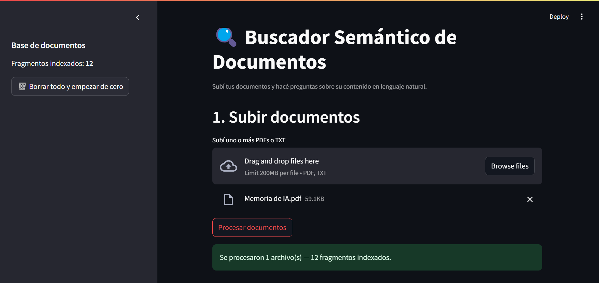
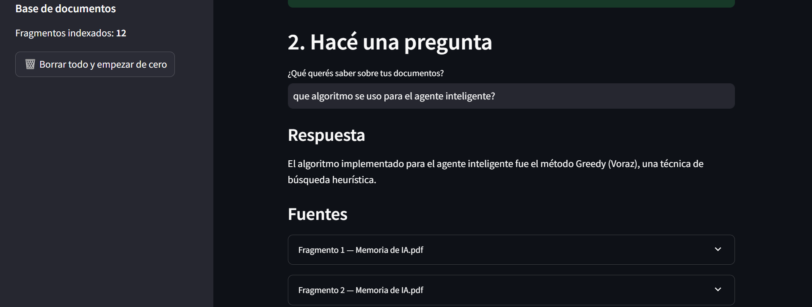

# Buscador Semántico de Documentos (RAG)

Sistema de **Retrieval-Augmented Generation (RAG)** que permite subir documentos (PDF/TXT) y hacer preguntas sobre su contenido en lenguaje natural. A diferencia de un buscador tradicional, que busca coincidencias exactas de palabras, este sistema entiende el **significado** de la consulta gracias a embeddings semánticos, y genera una respuesta a partir de los fragmentos más relevantes de los documentos.

## Demo




## Cómo funciona

1. **Ingesta**: el documento se extrae y se divide en fragmentos (*chunks*) de tamaño manejable, con superposición entre ellos para no cortar ideas a la mitad.
2. **Embeddings**: cada fragmento se convierte en un vector numérico que representa su significado, usando `sentence-transformers` (modelo `all-MiniLM-L6-v2`, corre 100% local, sin costo).
3. **Almacenamiento vectorial**: los vectores se guardan en `ChromaDB`, una base de datos vectorial persistente.
4. **Búsqueda semántica**: cuando el usuario hace una pregunta, esta también se convierte en vector, y se buscan los fragmentos de los documentos más similares semánticamente (no por coincidencia exacta de palabras).
5. **Generación**: esos fragmentos se pasan como contexto a un modelo de lenguaje (vía la API de **Groq**, gratuita), que genera una respuesta en lenguaje natural citando únicamente lo que aparece en los documentos.

```
PDF/TXT → extracción de texto → chunking → embeddings → ChromaDB
                                                              ↓
Usuario pregunta → embedding de la pregunta → búsqueda semántica
                                                              ↓
                                        fragmentos relevantes + pregunta → LLM → respuesta
```

## Stack

| Componente | Tecnología |
|---|---|
| Lenguaje | Python |
| Embeddings | `sentence-transformers` (all-MiniLM-L6-v2) |
| Base de datos vectorial | `ChromaDB` |
| Extracción de PDFs | `pypdf` |
| Generación de respuestas | API de Groq (Llama 3.1 8B) |
| Interfaz | Streamlit |

## Instalación

```bash
git clone <tu-repo-url>
cd buscador-semantico
python -m venv venv
source venv/bin/activate   # Windows: venv\Scripts\activate
pip install -r requirements.txt
```

Copiá `.env.example` a `.env` y agregá tu API key de Groq (gratuita, se consigue en console.groq.com):

```bash
cp .env.example .env
```

```
GROQ_API_KEY=tu_api_key_aca
```

## Uso

```bash
streamlit run app.py
```

Abrí el navegador en `http://localhost:8501`.

1. Subí uno o más documentos (PDF o TXT) y hacé clic en "Procesar documentos".
2. Escribí una pregunta sobre el contenido en el campo de texto.
3. La app muestra la respuesta generada junto con los fragmentos exactos de los documentos que la sustentan.
4. Desde la barra lateral se puede ver cuántos fragmentos hay indexados y borrar toda la base para empezar de cero.

## Estructura del proyecto

```
buscador-semantico/
├── app.py              # Interfaz Streamlit
├── ingest.py            # Extracción de texto, chunking, embeddings y manejo de Chroma
├── rag.py                # Búsqueda semántica + generación de respuesta con Groq
├── requirements.txt
├── .env.example
├── data/                 # Carpeta de trabajo (no versionada)
└── capturas/             # Screenshots para este README
```

## Decisiones de diseño

- **Chunking con superposición**: los fragmentos se dividen con un solapamiento de caracteres entre uno y otro, para evitar que una idea quede cortada justo en el límite de un chunk y pierda contexto.
- **Embeddings locales**: se eligió `sentence-transformers` en vez de un servicio de embeddings pago, para que la ingesta de documentos sea gratuita y no dependa de conexión a una API externa.
- **Groq en vez de un LLM pago**: permite tener el pipeline de generación completo (RAG de punta a punta) sin costo, ideal para un proyecto personal/demo.
- **Persistencia con ChromaDB**: la base vectorial vive en disco (`chroma_db/`), así que los documentos indexados sobreviven a reinicios de la app.

## Posibles mejoras futuras

- Soporte para más formatos de archivo (Word, Markdown, HTML)
- Chunking más inteligente, respetando límites de oraciones/párrafos en vez de una cantidad fija de caracteres
- Guardar los documentos originales para poder descargarlos de vuelta
- Métricas de evaluación de calidad de las respuestas (relevancia de los fragmentos recuperados)
- Deploy público en Streamlit Community Cloud

## Motivación

Proyecto personal para practicar conceptos de IA aplicada — embeddings, bases de datos vectoriales y arquitecturas RAG — que hoy son ampliamente usados en sistemas de búsqueda inteligente y asistentes basados en documentos propios.